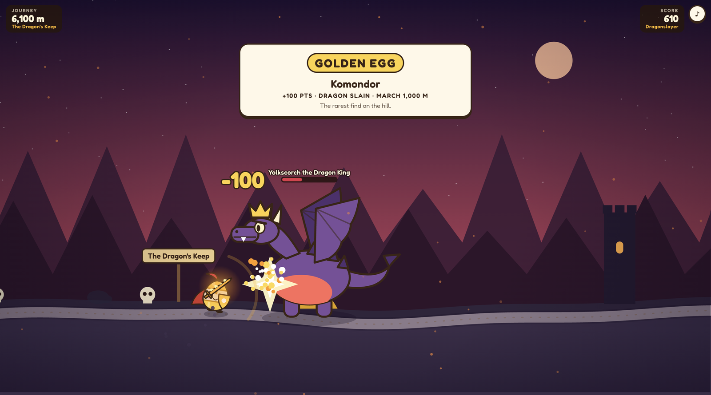
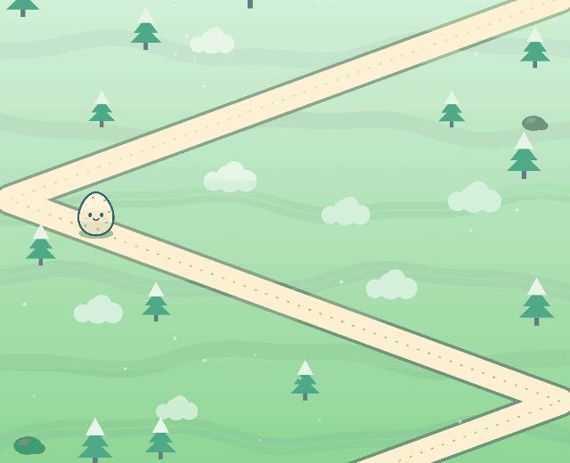
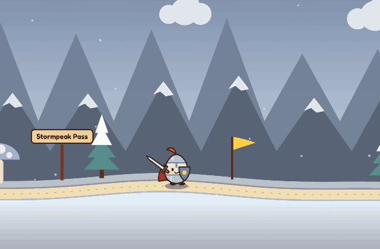

<div align="center">

# 🥚 Eggvolution

**Name something rare. Watch your egg evolve.**

A daily word game where uncommon answers roll an egg down a fantastical hill — or march it, sword in hand, into battle with dragons.

[](https://eggvolution-eta.vercel.app)

[](https://developer.mozilla.org/docs/Web/JavaScript)
[](https://nodejs.org)
[](https://nodejs.org/api/sqlite.html)
[](https://developer.mozilla.org/docs/Web/API/Canvas_API)
[](https://developer.mozilla.org/docs/Web/API/Web_Audio_API)
[](https://fonts.google.com/specimen/Fredoka)
[](https://vercel.com)

<br>



<sub>Quest mode: a Golden Egg answer lands a 100-point blow on the Dragon King.</sub>

</div>

## How it plays

Seven prompts, 25 seconds each. Every prompt asks you to name one thing — *a yellow fruit*, *a river*, *a word for "big"*. Any valid answer scores, but the answers nobody else thinks of score far more. "Lemon" gets you 10 points. "Yellow dragon fruit" gets you 100.

| Points | Tier | What it means |
| ---: | --- | --- |
| 10 | **Shell** | The first thing everyone says |
| 15 | **Half-Baked** | Feels clever, but plenty of people land on it |
| 30 | **Carton** | Common |
| 60 | **Free Range** | Genuinely uncommon |
| 85 | **Double Yolk** | A deep cut |
| 100 | **Golden Egg** | One hand-picked rare answer per prompt |

A perfect game is 700.

The clock is not gentle. In the last ten seconds a heartbeat starts, the screen reddens and the card rattles. A guess that isn't on the list costs three seconds. A guess that is only misspelled costs nothing: the game offers the corrected spelling ("Did you mean *therizinosaurus*?") and Enter accepts it.

## Three ways to play

<table>
<tr>
<td width="50%" valign="top">

### 🏔️ The Roll



Your egg rolls down a switchback path, 10 metres per point, and cooks into a new form every 100 points:

raw → hard-boiled → soft-boiled → poached → scrambled → omelette → fried

Reach 700 and it lands sunny-side up in the Great Skillet.

- **Daily** — the same seven prompts for everyone, once a day, with a leaderboard.
- **Unlimited** — seven random prompts, as often as you like.

</td>
<td width="50%" valign="top">

### ⚔️ The Quest



The same game turned sideways. A dragon lands in the road for every prompt, and your answer is your sword stroke.

- Hit for **60 or more** and the dragon is slain. Less, and it only flies off.
- Run out of time and you get toasted.
- Every 100 points earns new gear: sword, helm, shield, cape, golden plate, flameblade — and at 700, a crown.

Seven lands, seven dragons, ending with Yolkscorch the Dragon King.

</td>
</tr>
</table>

## Accounts, the curve and leaderboards

You can play as a guest, or create an account (a username and password, nothing else) to keep your scores.

- **How you compare.** Every finished game shows a bell curve of total scores with yours marked on it, and for each answer how it ranks against every answer given to that prompt, with a small chart of which tiers people land in.
- **Leaderboards.** *Today* ranks the day's roll, *All-time* totals each player's daily rolls, and *Quest* ranks best quest scores. Only signed-in players appear.
- **Play first, sign in after.** A guest who finishes a daily roll or a quest can sign in from the end screen and attach that run to their account.
- **One daily roll per account**, enforced on the server, and visible from any device you sign in on.

The curve is a normal distribution fitted to real games in that mode. While a mode has few games it leans on a starting guess (average 240, spread 90) that real results steadily outweigh, and the end screen says so.

## Run it locally

```sh
git clone https://github.com/ylemiesa57/Egg.git
cd Egg
npm start        # http://localhost:4747
```

There is nothing to install: the project has no dependencies. It needs Node 22.13 or newer for the built-in SQLite module.

| Command | What it does |
| --- | --- |
| `npm start` | Serve the game (set `PORT` to change the port) |
| `npm test` | Run the matching and statistics tests |
| `npm run seed` | Check `data/prompts/*.json` for problems |

## Tech stack

| Layer | Tool | Used for |
| --- | --- | --- |
| Rendering | [Canvas 2D API](https://developer.mozilla.org/docs/Web/API/Canvas_API) | Every pixel of both worlds is drawn in code — there are no image assets |
| Sound | [Web Audio API](https://developer.mozilla.org/docs/Web/API/Web_Audio_API) | Synthesised blips and chords |
| Client | Vanilla [JavaScript](https://developer.mozilla.org/docs/Web/JavaScript), HTML, CSS | No framework, no build step |
| Type | [Fredoka](https://fonts.google.com/specimen/Fredoka) | Display and UI text |
| Server | [Node.js](https://nodejs.org) `http` | Static files and a small JSON API |
| Database | [SQLite](https://www.sqlite.org) via [`node:sqlite`](https://nodejs.org/api/sqlite.html) | Prompts and ranked answers (in memory); accounts, runs and statistics (a local file) |
| Production database | [Turso](https://turso.tech) over its HTTP API | The same SQLite schema, hosted, when `TURSO_DATABASE_URL` is set |
| Auth | [`node:crypto`](https://nodejs.org/api/crypto.html) | scrypt password hashes, hashed session tokens in an HttpOnly cookie |
| Charts | Hand-written SVG | The score curve and tier bars |
| Tests | [`node:test`](https://nodejs.org/api/test.html) | Answer matching and statistics |
| Hosting | [Vercel](https://vercel.com) | Static hosting plus serverless functions |

## Prompts and rankings

The game ships with 65 prompts and about 2,700 ranked answers in `data/prompts/*.json`:

```json
{
  "text": "Name a yellow fruit",
  "category": "food",
  "answers": [
    { "a": "lemon", "pts": 10 },
    { "a": "starfruit", "pts": 30, "alt": ["carambola"] },
    { "a": "yellow dragon fruit", "pts": 100, "alt": ["yellow pitaya"] }
  ]
}
```

`alt` lists other accepted names. Matching already ignores case, accents, punctuation, spacing, leading articles and plurals, and near-miss spellings are offered back as suggestions, so alternates are only needed for genuinely different names.

The tiers are editorial judgement, not measured frequency. To improve a prompt, edit its JSON and restart the server (`npm run seed` reports any problems in the files). Answers that players type but the game does not recognise are logged to the `misses` table, which is the best source of what to add:

```sql
SELECT prompt, raw, count FROM misses ORDER BY count DESC;
```

## Project layout

```
api/            Vercel function entry points (each one hands off to server/index.js)
data/prompts/   Prompt and answer files
public/
  eggs.js       The eight egg forms
  world.js      The downhill world (daily and unlimited)
  quest.js      The side-scrolling world, the armored hero and the dragons
  charts.js     The score curve and tier bars
  account.js    Sign-in and leaderboard dialogs
  game.js       Round flow, timer and pressure, reveal, end screen
server/
  index.js      HTTP server and API routes
  db.js         Prompt content, loaded into memory
  store.js      Player data: local SQLite file, or Turso in production
  auth.js       Accounts and sessions
  stats.js      The score curve and per-answer comparisons
  match.js      Answer normalisation and spelling suggestions
```

## Deployment

The live site runs on Vercel: `public/` is served statically and the files in `api/` run as serverless functions.

Serverless functions have no disk, so player data needs a hosted database. The server talks to [Turso](https://turso.tech) (hosted SQLite) when these two environment variables are set, and creates its tables on first use:

| Variable | Value |
| --- | --- |
| `TURSO_DATABASE_URL` | `libsql://<database>.turso.io` |
| `TURSO_AUTH_TOKEN` | A database token |

The quickest way to get both is the Vercel Marketplace, which sets them on the project for you:

```sh
vercel integration add tursocloud/database
vercel deploy --prod
```

Without them the game still plays, but accounts and leaderboards are switched off and the comparison charts only see games handled by the same function instance.

Sessions last 30 days. There is no email on an account, so there is no password reset.

## Credits

Inspired by [Krillion](https://krillion.io). Released under the [MIT License](LICENSE).
